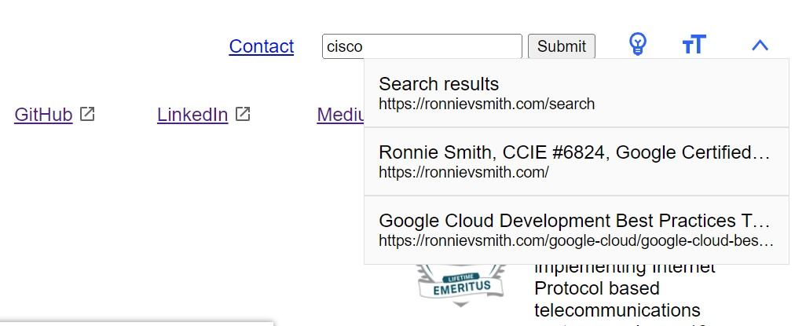

# Lunr.js Working Example w/ HTML Search Input and Dialog for Results
The lunr.html file is a basic working demo of Lunr.js. The search input is a standard HTML input with `type=search` and the results are rendered in the standard HTML dialog element. The index file that Lunr.js is using is hosted on my website.

The scraper.js file is a script for Node.js. This script generates an index.json file based on the lines read from a sitemap.txt file hosted on my website. Use this Node.js script to generate your own index file for Lunr.js to search. If your sitemap is in XML format you will need to modify this script to read XML or create a sitemap.txt file listing your URLs.

